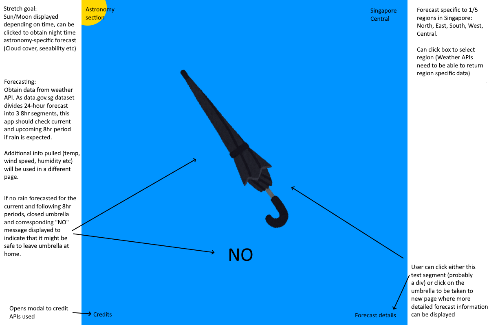
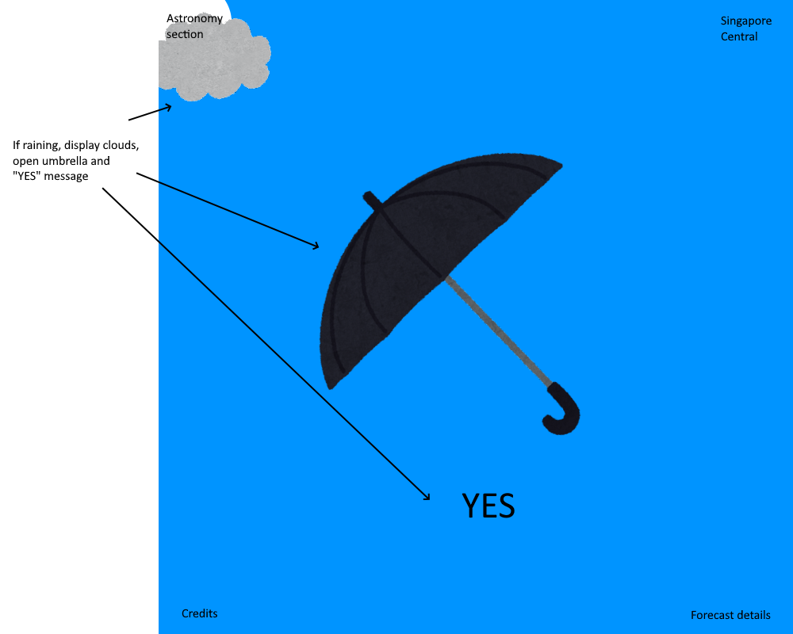
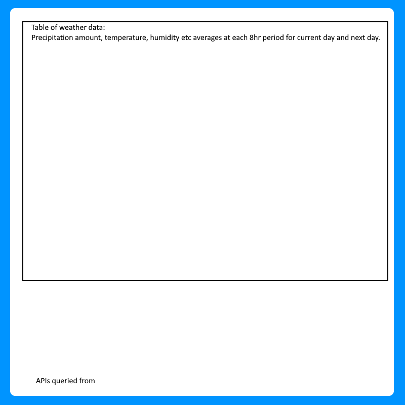

# <a href="" target="_blank">Umbrella-Today-TS</a>

React app utilizing weather APIs to decide if user should bring out their umbrella. Ported to Typescript as a personal challenge.

### Description

App is intended to be as simple to use as possible. On loading up the site, page immediately checks weather forecasts to see if an umbrella would be necessary in the 12 hours to come from time of access. App also provides detailed weather forecasts in 3-hr time blocks as well as astronomy-related weather forecasts.

 

## Technologies used

### React

This app was built with React. App comprises of 3 pages, linked via React Router, and each page was further divided into specialized components.

### Typescript
This app was originally built with React.js but was then ported to React.ts as a personal exercise in creating Typescript projects.

### Bootstrap

<a href="https://getbootstrap.com/" target="_blank" >Bootstrap</a> was used primarily to position elements within textboxes.

### CSS

Where positioning with bootstrap proved complicated, CSS was used for more strictly positioned elements. CSS was also utilized to provide animations via transitions when modals/drawers were clicked.

### Material UI

<a href="mui.com" target="_blank" >Material UI</a>, a React component library, was utilized to provide complex, pre-built components to aid in development and as practice for using externally built components.

 

## Wireframes

Main page wireframe, detailing interactive elements with plans on how they would function. This wireframe shows what the main page would look like if no rain was forecast.

Alternate main page wireframe, featuring main page if rain was forecast.

Forecast/Astronomy page wireframe, a rough design to show how the field displaying data might look like.

 

## User Stories

This app was made for users who are rushing out to start the day but are wondering **whether to invest carry-on space on their pocket umbrellas**. When these users open up this app, they would be advised on whether to bring their umbrellas as quickly as the app can fetch data from their devices and can thus, more quickly arrive at their decision before busting out the door.

### Additional forecast information

As obtaining all these weather data only for the user to have an extremely simplified glimpse might seem to be a waste to some users, **detailed information** about weather forecasts were displayed on a separate page, in which up to 3 days of weather forecasts, portioned into 3-hour segments, were made available.

### Astronomy forecast for stargazers

The weather is one of the biggest hindrances to stargazing and as such, users in the stargazing community are able to utilize this app to gauge how conducive the weather at night would be for their activities. **Astronomy-specific weather data** (atmospheric transparency, astronomical seeing etc) are presented on a separate page of the app, forecasting weather conditions that could significantly affect astronomical observations.

### Region specificity

App was developed primarily for use in Singapore and as such, **forecasts on load** are, for the most part, only relevant for users in Singapore.

However, app features geolocation support, which takes in the user's device's coordinates for forecasting, and can accept input of custom coordinates to check forecasts for any point on the globe!

 

## Planning and Development Process

For this app, I started by planning the pages I would need for displaying information obtained from the 7Timer API. As the primary purpose of this app was to recommend if an umbrella should be brought along before the user left the house, I had decided that the landing page would have to query the API and make the recommendation immediately. Additional information would then be routed to other pages, a Forecast page for detailed weather forecasts and an Astronomy page for astronomy-related forecasts.

After the pages, I started work on components to construct the elements that would make up the landing page, including components to harbour links for users to click away from.

Whenever a component became too complex, I attempted, as much as possible, to split these into smaller components for better code organization and functional scoping.

While developing this app, I attempted to diversify my page elements as much as I could, making use of modals, drawers, clickable textboxes and images etc.

### Challenges

1. In order to minimize fetching as much as possible, I had intended to prop weather data from the Main page to the Forecast page. However, as the Forecast page could not be a child component of the Main page due to routing, I could not utilize props to achieve this.

2. Another major challenge was attempting to fetch data when it mattered. During development, a problem that frequently occurred was that data was not being fetched when coordinates were changed.

3. For better viewing experience, I had attempted to fade out the dark backdrop of modals and drawers using CSS' transition and opacity properties. However, with the way my modals and drawers had been implemented, closing them would immediately dismount the components, leading to an abrupt disappearance of the backdrop.

### Problem-Solving Strategy

1. The solution to moving data between pages came to me in the form of utilizing NavLink's state to store data in an object and using the useLocation hook to access this state.

2. By introducing a state to store coordinates to be used in a useEffect's dependency array which calls the function to fetch data, the app was thus able to fetch data whenever coordinates were changed, which would only be when a new location was selected or custom coordinates were entered via the location drawer.

3. To prevent this abrupt disappearance, I delayed the functions that closed the modal/drawers (those called upon clicking confirm/cancel) using setTimeout, allowing the animation to run to near completion before the component dismounted.

### Unsolved problems

Detailed forecasts are only displayed in UTC time or Singapore time. However, it should be fairly easy to correct this to showing system local time instead and thus, would be fixed in subsequent iterations.

The 7Timer! API also returns up to a week's worth of weather forecast data but only 3 days' worth was used since I had intended for this app to be used within the same day. However, the other days' forecasts could have been separated via pagination to be kept out of sight but still available.

 

## APIs Used

Weather API (CIVIL) from <a href="http://www.7timer.info/doc.php?lang=en" target="_blank">7Timer!</a> was used to obtain data for weather forecasts. These data were primarily used for umbrella recommendations but were also presented in detail for users.

Astronomy API (ASTRO) from the same site was also utilized to generate astronomy-specific weather forecasts.

 

## Acknowledgments

- Umbrella and cloud images by <a href="https://www.irasutoya.com/" target="_blank">Mifune Takashi, みふねたかし</a>.

- <a href="mui.com" target="_blank" >Material UI</a> React library.

- <a href="https://getbootstrap.com/" target="_blank" >Bootstrap</a> CSS framework.

## References

For explanations of astronomical forecast parameters

- <a href="https://skyandtelescope.org/astronomy-resources/transparency-and-atmospheric-extinction/" target="_blank" >Transparency and Atmospheric Extinction</a>, Tony Flanders and Phillip J. Creed, 2008

- <a href="https://weather.gc.ca/astro/seeing_e.html" target="_blank" >Seeing Forecast for Astronomical Purposes</a>, Government of Canada, 2023
